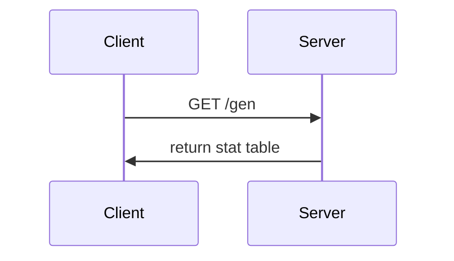

# CS361 Microservice

A simple stat block generator REST microservice for CS361.

## Usage

To use this project, you can either use the hosted version at [cs361.moritamcvey.net/gen](https://cs361.moritamcvey.net) or self-host the project using the steps in [Installation](#installation).

To get a stat block, send a GET request to `/req` with a `difficulty` integer value.
The server will return a `JSON` object with the calculated stats.
The `JSON` response will consist of five elements:

```json
"difficulty": 1 // The difficulty value that was given in the request
"name": "Alex Lee" // A random name
"health": 123 // A random health value (i32)
"damage": 21 // A random damage value (i32)
"stamina": 12 // A random stamina value (i32)
```

### Example

The following example uses `curl` and the microservice hosted at [cs361.moritamcvey.net/gen](https://cs361.moritamcvey.net/gen).

```sh
curl "https://cs361.moritamcvey.net/gen?difficulty=1"
```

returns:

```json
{
  "difficulty": 1,
  "name": "Alex Lee",
  "health": 123,
  "damage": 21,
  "stamina": 12
}
```

### Sequence Diagram



## Installation

### Docker

To self-host with docker, you can pull the package from the GitHub package repository. Here are some example snippets:

docker-compose file (`compose.yml`):

```yaml
services:
  cs361_microservice:
    image: "ghcr.io/kekoam/cs361_microservice:main"
    container_name: cs361_microservice
    restart: unless-stopped
    ports:
      - "8080:8080"
```

Docker CLI:

```sh
docker run -d \
  --name=cs361_microservice \
  -p 8080:8080 \
  --restart unless-stopped \
  ghcr.io/kekoam/cs361_microservice:main
```

### Building from source

You will need to install [cargo](https://rustup.rs/).

```sh
git clone https://github.com/KekoaM/cs361_microservice.git
cd cs361_microservice
cargo build --release
```

You can replace the last command with `cargo run --release` to build and run at once.

The server will bind to port `8080` on all interfaces by default.
